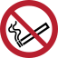
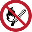
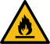
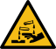
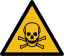

# Safety in the Studio

The printmaking studio is full of hazardous materials and equipment. It is therefore necessary to exercise caution when working in the studio. You should familiarise yourself with the important signage that will be present throughout the studio environment. Some of the more common signage you can expect to see across a printmaking studio may include the following but are not limited to them as each studio operates at a different level and safety requirement.

> [!CAUTION]
> **YOU SHOULD OBSERVE ALL SAFETY REGULATIONS EXERCISED BY YOUR STUDIO**.

| Sign                                          | Meaning               | Why this matters                                                                                                                                                                 |
| --------------------------------------------- | --------------------- | -------------------------------------------------------------------------------------------------------------------------------------------------------------------------------- |
|  | Wear closed toe shoes | It's necessary to wear PPE (Personal Protective Equipment) in a printmaking studio to safeguard yourself from accidental spills, dropped equipment, and other hazards.           |
|   | Wear a respirator     | Corrosive chemicals like acids are often part of printmaking techniques, they and other toxic materials like inks and solvents expel fumes which may be harmful (and often are). |
|           | Wear gloves           | Necessary to safeguard yourself from dangers of hazardous chemicals, reactions, and contamination.                                                                               |
|          | Wear a face mask      | When not working around corrosive materials like acid, a face mask is often sufficient to protect against solvent fumes.                                                         |
|           | No smoking            | Printmaking studios contain flammable material and fumes that may ignite from sparks. **No smoking near or around a printmaking studio.**                                        |
|        | No open flames        | Printmaking studios contain flammable material and fumes that may ignite from sparks. **No smoking near or around a printmaking studio.**                                        |
|          | Flammable             | Signage like this identifies flammable material, make sure there are no open flames or sparks nearby. **Be mindful of hazards.**                                                 |
|               | Corrosive             | Signage like this identifies corrosive material, make sure to exercise extra caution and wear PPE. **Be mindful of hazards.**                                                    |
|                | Poisonous             | Signage like this identifies poisonous material and should not be ingested. **If ingested seek medical assistance immediately.**                                                 |

> [!CAUTION]
> Signage may differ depending on region as these are country specific in many cases but the intent is always the same. Always understand the signage relevant to your studio.

## Studio Safety Reference

Please follow these guidelines to ensure safety in the printmaking studio environment. This is a general rule of thumb and is expected across most if not all printmaking studios.

 > [!IMPORTANT]
>  These rules are not merely suggestions and should be considered when setting up you own space. You may need to adjust these rules accordingly to your own studio setups slightly as no two printmaking studios are the same. What is important is that the environment is both safe and comfortable to work in. This may also mean that you may not be able to execute particular methods in your studio because of safety or comfort concerns. Always keep safety first.

| You should...                                                                                                   | You shouldn't                                                                                      |
| --------------------------------------------------------------------------------------------------------------- | -------------------------------------------------------------------------------------------------- |
| Wear closed toe shoes to avoid injury                                                                           | Have an open flame in the studio environment including smoking                                     |
| Tie back and/or cover your hair to avoid any falling onto the work surface                                      | Consume food or drink in the studio                                                                |
| Wear nitrile gloves when degreasing your plate or working with solvents of any kind                             | Place anything sharp under the press                                                               |
| Wear protective clothing such as acid resistant gloves, apron, and goggles/visor when handling acid or any kind | Place anything heavy on the press that should not be there including sitting/standing on the press |
| Wear a filtered mask when handling solvents, near the presence of fumes, and when working with rosin            | Bring an open flame near the solvent station or acid baths                                         |
| Ensure all exhausts where present are operating when working with solvents and acid                             |                                                                                                    |
| Work in a well ventilated environment, especially when handling solvents                                        |                                                                                                    |
| Identify all pinch points near the press and be careful when handling them                                      |                                                                                                    |

