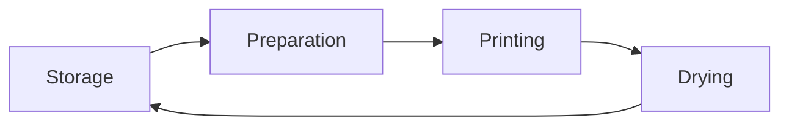

# The Printmaking Studio

A printmaking studio is often equated to a well oiled machine. It is designed for efficiency and as such is divided into areas or zones where particular work can be done. Many studios often are very strict about maintaining this distinction between work zones and should be respected and adhered to for efficient printing. There are two main zones in a printmaking studio: the wet area, and the dry area.

> [!TIP]
> The printmaking studio can get messy, **very messy**! That is not a bad thing and often is the hallmark of a well used and loved studio. You should embrace the mess rather than fight it as that is the best way to enjoy your time in the printmaking studio. That said, you should be careful of *where* the messy work happens to avoid conflict!

## Studio Zones

Each zone has a particular kind of work associated with it, as well as particular equipment and management expectations. There is a level of overlap between areas but there should be a clear distinction between the 'wettest' and 'driest' areas of the studio.

### Dry Area

All printmaking starts here in the dry area. This is where the image is prepared to be transferred onto the matrix as well as where paper may be stored, prints framed, and a cleaner environment is expected. In most cases this is where most of your time as a printmaker will be spent in platemaking. Some things that will be in the dry area include:

- **Paper storage:** Clean storage for paper to be used in printing.
- **Surface preparation stations:** Such as an area to cut sheets and prepare registration.
- **Platemaking stations:** Typically benches or an area where platemaking is possible.
- **Tool area:** This can be racks or benches for preparing and maintaining tools such as a sharpening station or a place to store tools for easy access.
- **Drying station:** For after a print has been pulled, the paper needs to be dried either by hanging it or on a wire rack. Often times drying stations will also have a flattening bench for ensuring prints remain flat. 

### Wet Area

This is where the messy part of printmaking happens! The wet area will be where printing occurs as well as where some platemaking and paper preparation. In most cases this may take up most of the space in a studio depending on the kind printing possible there. Some things that will be in the wet area include:

- **Printing stations:** The area where the press is located.
- **Inking tablets:** Glass tablets for preparing ink.
- **Storage:** Specifically for inks and printing equipment i.e. messy storage.
- **Disposal:** Specifically of wet and domestic waste.
- **Solvent & Cleaning station:** The area where the matrix will be cleaned as well as cleaning supplies.
- **Blotting station:** Often includes a sink or tub for soaking paper and an area for laying out a towel to blot the paper.

### Overlap

As mentioned there is a level of overlap that occurs between these main two zones in the studio. This is because often times you will be working in a material that is wet but are still in the platemaking phase of your process. These areas should be adjacent to their respective zones and should be kept far from the wettest or driest parts of the studio respectively. For instance, in the intaglio studio you will often need to work with bitumen a hazardous substance that is wet and rather messy. This is part of the platemaking process and should be done near the solvent cleaning station, therefore it would make sense to have this area overlap with the dry area to an extent.

> [!IMPORTANT]
> **How to setup a studio space.** Printmaking studios come in all shapes and sizes and you should use these guidelines as a way to design your own studio environment. Here are few things to remember for your own setups:
>
> - First establish what kind of printing will you be doing in this studio. An intaglio studio will be planned differently to a screen printing studio which requires more wet areas.
> - Consider the distribution of equipment
> - Consider how much space you can allocate to storage and if you need to be smart about storage (vertical racks for instance)
> - Is there enough ventilation in the studio? An intaglio studio will have more hazardous materials than other methods.
> - Ensure there is a clear distinction between the wettest and driest zones of your studio for efficient clean printing.

## Process

You may be wondering why these zones are even required? The segregation of a printmaking studio is necessary because of the printmaking process which involves the following components:

**Storage:** Efficient studios start (and end) by ensuring plate and prints both can be stored in order to be worked on. This is because the method being used in the studio may have different storage requirements, for instance, in a lithography studio you need some place to store large blocks of stone, similarly in a serigraphy studio you need to be able to store different sizes of screens. A mix of cupboards, drawers, hooks, pegboards, trolleys, and boxes is common to see as storage units in a studio.

**Preparation:** Once you have access to either plate or paper you need to be able to bring preparing your matrices. Depending on the type of printing expected in the studio the level of preparation will be different. You may need benches, sturdy tables, and more to accommodate the matrix being worked on and the different tools you require. It is common practice to have a wall of tools for easy access, this is an area where most studios will overlap between dry and wet zones. A good lighting setup is also necessary here as is ventilation as often times acid baths for intaglio are in this area as well.

**Printing:** This is perhaps where the need for a segregated studio becomes important. The printing component of printmaking should be in a clean environment but the process of preparing a plate for printing is messy. A well segregated studio will be able to accommodate this mess to ease efficient printing. This is why presses are normally kept in between the wet and dry zones, and many studios are very strict about keeping the press clean! **Especially any felt blanket on the press when working in an intaglio studio, *always keep the blankets clean!***

**Drying:** Finally once the print is pulled it needs to be put aside to dry, irrespective of whether the paper was blotted or not. The ink itself is wet and takes time to absorb into the paper or fabric. A well organised studio should have drying racks (vertical or horizontal) to facilitate this part of the process.

This is the cyclic process of printing and once the matrix is prepared the printing and drying components are repeated to as many times as needed. The reproducibility aspect of printmaking is also a reason why this method of segregating the studio is important and makes the printmaking studio unique.