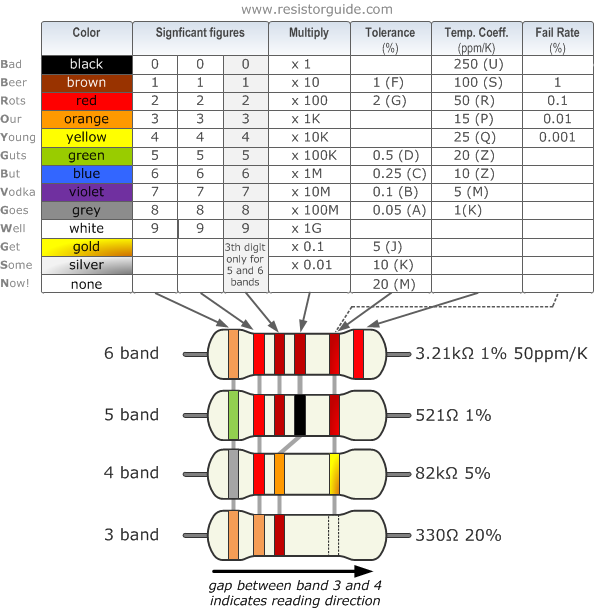

# Circuits 101

>[!SUCCESS]
> **Goal.** Make a simple circuit that lights up an LED using a battery as a power source. This will introduce you to how electricity flows in a circuit.

## Instructions for TinkerCAD

<iframe width="100%" height="600px" frameborder="0" allowfullscreen="" src="https://dubble.so/guides/circuits-101-ty8yyhysyp4bt0fgn4ox?embed=1"></iframe>

## Components

- Breadboard - 1 LED (any colour)
- 1 resistor (220Ω or 330Ω is ideal)
- 1 battery holder with 2 AA batteries (3V total) **or** a 9V battery with a battery clip
- Jumper wires

## Step-by-Step Instructions

{}
1. ### Understand the Flow
    - Think of a circuit like a water loop. Electricity flows from the battery (power source), through your components (like the LED), and back to the battery.
    - **+ (positive)** = where electricity flows _from_
    - **– (negative or ground)** = where electricity flows _to_
    
2. ### Place the LED on the Breadboard
    - LEDs have two legs: a **long leg (+)** and a **short leg (–)**.
    - Insert the **long leg** into one row of the breadboard and the **short leg** into a different row (not the same).
    
3. ### Add a Resistor
    - Connect a **220Ω resistor** to the **short leg (–)** of the LED. This protects the LED from too much power. If you are not sure of what resistor you have you can follow this chart, or ask a technician in the Hackspace.
    - Put the other end of the resistor into a separate row on the breadboard.
       
    
4. ### Connect to Power
    - Use a **jumper wire** to connect the row with the **long leg** of the LED to the **positive (red) wire** from the battery pack.
    - Use another **jumper wire** to connect the row with the **other end of the resistor** to the **negative (black) wire** from the battery pack.
    
5. ### Turn on the Power
    - Insert the batteries into the holder or connect the 9V battery.
    - Your **LED should light up!**
{}

## Task

- Swap out the LED for a different colour.
- Try using two LEDs in **series** or **parallel** (what happens to the brightness?).