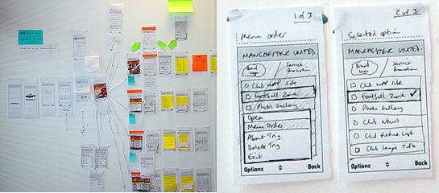
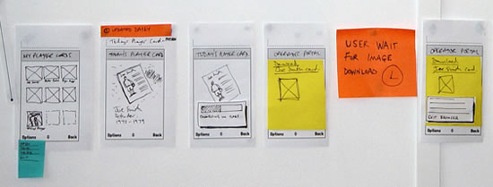
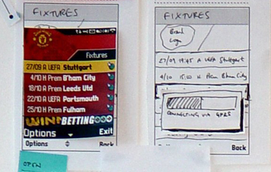

# Case Study: Paper Prototyping

>[!NOTE]
> Adapted from Preece, et al. Interaction Design

## Design of a ‘Manchester United Fan’ mobile phone UI

This example project provides a walkthrough of various issues considered when designing a mobile phone UI. The example covers a relatively small mobile phone application for the purpose of illustrating the method in use. By contrast, designing complete mobile phone applications such as ‘contacts’ or ‘messaging’ would be a much more involved process.

### The Design Scenario

Imagine we are asked to design a ‘rich content experience’ for a mobile telecoms operator company. They want to target their customers’ personal interests, and provide them with downloadable ‘themes’. The operator wants to encourage customers to utilise online services - like downloading wallpaper images, and checking online information. The idea is that ‘themes’ will change the way the customers’ phone looks onscreen as well as provide new content features. The example for this scenario is a ‘Manchester United’ football team theme, targeting fans of the team. The theme could equally be for a music artist, a blockbuster film, a celebrity figure and so on.

#### User Focus: Identify user goals

A first step in the design process would be identifying the key user goals that the service is to support. The user goals provide a design reference point throughout the paper prototyping work. Some example user goals would include:

- Checking the latest wallpapers that could be downloaded- Downloading the chosen wallpaper- Changing the wallpaper setting of the phone to the new downloaded wallpaper
- Checking the team news headlines- Checking an individual news story- Checking the team’s upcoming fixtures- Checking the team’s position and scores in the league table  

#### Content audit/structure: Identify features and content
As well as considering user goals, we need to detail the content and features of the product. This includes identifying the content available, the desired features and the overall user experience the operator wants to achieve. For this project, some of the areas to consider would be:  

- Client focussed aims
    - Enable personalisation
    - Encourage customer usage of online content
- Content and features
    - Manchester United wallpaper images
    - Manchester United fixtures information
    - Manchester United news stories
    - Manchester United league tables updates
- UX considerations
    - The download and purchase process
    - The installation process for the theme
    - The switching between multiple themes
    - The navigation of the theme and its contents

Our aim would be for the design solution to meet the needs of both the client and the target user. This early stage in the design process would involve a period of brainstorming, where we consider all possible content and features individually, as well as how they would work together as a complete product.

#### First Paper Prototype: First Design Iteration

Once the user goals, content and features are mapped out, the first paper prototype can be created. The images in the following sections illustrate the paper prototypes and how they are used for different design decisions.

##### **Macro vs. Micro views**
Looking at the two images here (Figure 1) you can see that paper prototyping enables us to view the application we are designing at both a ‘macro’ and a ‘micro’ level. The macro view is where we take the entire application and view it in one. The micro view is where we ‘zoom’ into the details of particular application sections. In this image, we consider the details of which options appear to the user when they select ‘Options’ at that particular screen.

As we design, we switch between these two views constantly. A key benefit of the zooming is that it enables us to see that a service or application uses words, options, layouts and other elements consistently. Consistency is as important with mobile UI design as with any other user interface, so comparing the two views helps address this factor in a design.

*Figure 1 Micro and Macro views with paper prototyping*

_Figure 2 Screen by screen flows_

##### **Screen-by-screen flows**
We work to map out every individual screen, state and view the user will see on the final device UI. So here (Figure 2) for example, we have started at the point where the user chooses a ‘player card’ – one of the features of the application. They view a preview full-screen, they download it, link to a WAP browser screen, wait for the download process and get their card. It is important to capture every stage and state, as the paper prototype is our model of the user experience in fine detail.

##### **Sections and contents**
The sections of the application are drawn out in detail (Figure 3). This enables us to start exploring the content. For example, what would users expect when they view the wallpapers for their team? Do they want to see 20 on the screen at once or just 9? What design issues does that raise based on the visual design, the interaction, the marketing viewpoint and the network operator viewpoint? Every design decision needs to accommodate some of the varied stakeholders requirements.

##### **Design alternatives**
A key strength of paper prototyping is the ability to compare design alternatives (Figure 4). Here the example shows how we considered two designs for the Options menu items that would be displayed. Paper prototyping enabled us to compare the two designs, and view them side-by-side, within the context of the entire application. We could then remove the less effective design once a decision was made on which to pursue.

 

_Figure 3 Sections and contents_

  

_Figure 4 Design alternatives_

##### **Mobile phone network issues**
Mobile phone network issues (download processes, lost connections, etc.) are often more difficult to consider at the stage of paper prototyping. Network behaviour can be less predictable than we as designers would like. We aim to achieve the best user experiences while being told by network specialists that they cannot guarantee coverage, the speed of downloading and so on. It is important for us to consider the effect network issues will have on the overall user experience for customers at this early stage of design.

For example, the user is browsing a rich, graphical UI and looking at the Manchester United wallpapers on offer. What effect does the connection and download process of their selected wallpaper have on their overall experience with the product? Does the user have to wait for a connection to be made? Then do they have to wait long for the download? How long does each stage take? What impact does their combined duration have? Do we need to prompt users about what is happening or does it happen quickly? Can we predict approximately how long it will take or is this variable? Do we need to design various options for each situation?

This is a good example of where the network stakeholder, the client and the UX designer might interact with each other and discuss this. So how would each work here?

- Network person – would understand the technical issues of network latency and possible complications
- Client – would care about both the network, cost to operator and the user experience and how to make the business model work
- UX designer – would work as always, as the ‘UX diplomat’ between both what users need and what client wants

    

_Figure 5 Network issues_

##### **User wait times / User feedback**
If we need the user to do something, or wait for a process to complete, we need to provide clear onscreen feedback and dialogs so that we manage the users expectations. We need to map out any significant user wait times, consider how to provide feedback, and the wording to use so that the user experience is as smooth and consistent as possible.

##### **Navigation consistency**
Mapping out the entire application enables us to design navigation models that are consistent, across the application. This means the UI will be consistent in appearance, wording and behaviour regardless of section, content area, etc. Generally, the navigation issues for a mobile application will include:

- **Labels and words** - used in menus and onscreen throughout.
- **Hard keys** - on the keypad that are used to navigate.
- **Soft keys** - map to the onscreen word labels via the two hard keys left and right.
- **Options Menus** - most mobile phone UI’s offer the user a set of options, accessed at each screen and relevant to the context of that screen. This is an important element that we consider in paper prototyping. We use the approach to make sure that the wording, positions in the item list and other factors are consistent across all Options menus within the application UI.
- **Use of a ‘Back’ key** – this can either be onscreen as a softkey or a hard key on the keypad. It is one of the most important navigation issues for users ‘how do I get back a screen?’

_Figure 6 User wait times and feedback_

##### **Visual design treatments**
Paper prototyping is a visual process. The screens and their elements are drawn, rather than described using text. So very early on, designers can consider the visual elements of the user interface.

Here in the Manchester United example we can see how visual designers have created initial screen designs. Created quickly, they can add another level of detail to the paper prototypes and bring realism to the concept during the design process. Design considerations such as typeface, font size, screen size and pixel measurements can be addressed here. Screen size is a major constraint in designing for mobile applications, so using screen visuals that are ‘pixel perfect’ can be useful - for example, in considering whether proposed ‘Club news’ headlines will fit on the screen, or if they will need to be truncated. This in itself could have an effect on the overall user experience by affecting readability and access to the headlines information if truncated.

 

_Figure 7 Visual design treatments_