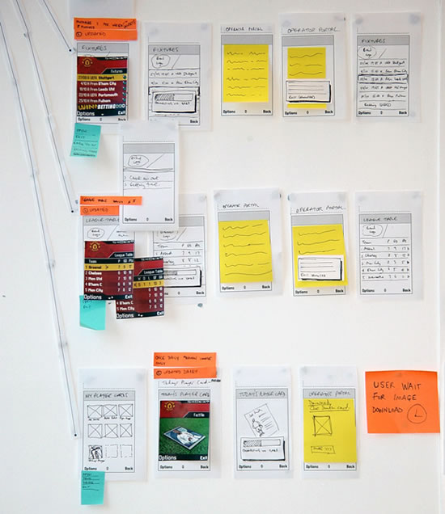
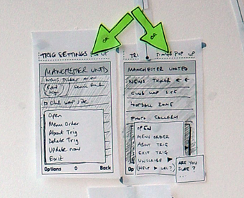
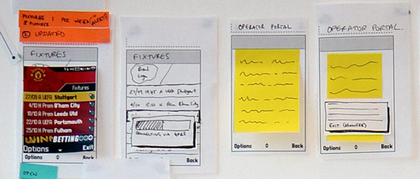
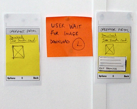

>[!NOTE]
> 本页面由英文自动翻译而成，内容中可能存在翻译错误
# 案例研究：纸质原型制作

>[!NOTE]
> 改编自 Preece 等人的《交互设计》

## “曼联球迷”手机用户界面设计

本示例项目将逐步介绍设计手机用户界面时需要考虑的各种问题。为了便于说明设计方法，本示例使用了一个相对较小的手机应用程序。相比之下，设计完整的手机应用程序，例如“联系人”或“短信”应用，则是一个更为复杂的过程。

### 设计场景

假设我们受邀为一家移动通信运营商设计“丰富的内容体验”。他们希望根据客户的个人兴趣，提供可下载的“主题”。运营商希望鼓励客户使用在线服务，例如下载壁纸图片和查看在线信息。其理念是，“主题”不仅能改变客户手机的屏幕显示效果，还能提供新的内容功能。本示例以“曼联”足球队为主题，目标受众是该队的球迷。主题同样可以用于音乐艺术家、热门电影、名人等等。

#### 用户聚焦：明确用户目标

设计流程的第一步是明确服务要支持的关键用户目标。用户目标将为整个纸质原型设计工作提供设计参考点。一些用户目标示例包括：

- 查看可下载的最新壁纸 - 下载选定的壁纸 - 将手机壁纸设置为新下载的壁纸

- 查看球队新闻头条 - 查看个别新闻报道 - 查看球队的赛程安排 - 查看球队在联赛积分榜上的排名和得分

#### 内容审核/结构：识别功能和内容

除了考虑用户目标外，我们还需要详细说明产品的内容和功能。这包括确定现有内容、所需功能以及运营商希望实现的整体用户体验。对于本项目，需要考虑的一些方面包括：

- 以客户为中心的目标
	- 实现个性化
	- 鼓励客户使用在线内容
- 内容和功能
	- 曼联壁纸图片
	- 曼联赛程信息
	- 曼联新闻报道
	- 曼联联赛积分榜更新
- 用户体验考量
	- 下载和购买流程
	- 主题安装流程
	- 多个主题之间的切换
	- 主题及其内容的导航

我们的目标是设计方案能够同时满足客户和目标用户的需求。设计流程的早期阶段将包含头脑风暴环节，我们将逐一考虑所有可能的内容和功能，以及它们如何作为一个完整的产品协同运作。

#### 第一个纸质原型：第一次设计迭代

一旦用户目标、内容和功能都已规划完毕，就可以创建第一个纸质原型了。以下各节中的图片展示了纸质原型及其在不同设计决策中的应用。

##### **宏观视角与微观视角**

观察此处的两张图片（图 1），您可以看到纸质原型使我们能够从“宏观”和“微观”两个层面来审视我们正在设计的应用程序。宏观视角是指我们将整个应用程序作为一个整体来查看。微观视角是指我们“放大”查看应用程序特定部分的细节。在这张图中，我们考虑了当用户在特定屏幕上选择“选项”时，会显示哪些选项。

在设计过程中，我们会不断地在这两个视角之间切换。放大视角的一个关键优势在于，它使我们能够看到服务或应用程序在文字、选项、布局和其他元素的使用上是否保持一致。与其他任何用户界面一样，移动 UI 设计中的一致性也至关重要，因此比较两种视图有助于解决设计中的这一因素。

*图1 微观和宏观视图及纸质原型*

图 2 逐屏流程图

##### **逐屏流程**

我们致力于绘制用户在最终设备用户界面上看到的每一个屏幕、状态和视图。例如，如图 2 所示，我们从用户选择“球员卡”（应用程序的一项功能）开始。他们全屏查看预览，下载卡片，链接到 WAP 浏览器页面，等待下载完成，最终获得卡片。记录每个阶段和状态至关重要，因为纸质原型是我们对用户体验的精细建模。

##### **版块和内容**

应用程序的各个版块已详细绘制（图 3）。这使我们能够开始探索内容。例如，用户在查看自己球队的壁纸时会有什么期望？他们希望一次在屏幕上看到 20 张壁纸，还是只显示 9 张？从视觉设计、交互、市场营销和网络运营商的角度来看，这会引发哪些设计问题？每一个设计决策都需要兼顾不同利益相关者的需求。

##### **设计方案**

纸质原型的一大优势在于能够比较不同的设计方案（图 4）。此处示例展示了我们如何考虑两种“选项”菜单项的设计方案。纸质原型使我们能够比较这两种设计方案，并在整个应用程序的上下文中并排查看。一旦确定了最终方案，我们就可以移除效果较差的设计方案。

 

图 3 各部分及内容

  

图 4 设计方案

##### **移动电话网络问题**

移动电话网络问题（例如下载过程、连接中断等）在纸质原型设计阶段往往难以考虑。网络行为的可预测性可能不如我们设计师所期望的那样高。我们力求实现最佳用户体验，但网络专家却告诉我们，他们无法保证网络覆盖范围、下载速度等等。因此，在设计初期阶段，考虑网络问题对用户整体体验的影响至关重要。

例如，用户正在浏览一个界面丰富的图形用户界面，查看曼联壁纸。他们选择的壁纸的连接和下载过程会对他们的整体产品体验产生什么影响？用户是否需要等待连接建立？下载过程是否需要长时间等待？每个阶段需要多长时间？它们的总时长会产生什么影响？我们需要提示用户当前状态吗？还是下载过程会很快完成？我们能否大致预测所需时间？还是这个时间会随情况变化？我们是否需要针对每种情况设计不同的方案？

这是一个很好的例子，说明网络利益相关者、客户和用户体验设计师如何互动并讨论相关问题。那么，他们各自会如何工作呢？

- 网络人员：了解网络延迟的技术问题和可能出现的问题

- 客户：既关注网络状况、运营商成本，也关注用户体验以及如何使商业模式有效运作

- 用户体验设计师：一如既往地扮演“用户体验桥梁”的角色，协调用户需求和客户期望。

    

图 5 网络问题

##### **用户等待时间/用户反馈**

如果我们需要用户执行某些操作或等待某个流程完成，我们需要提供清晰的屏幕反馈和对话框，以便管理用户的预期。我们需要规划任何显著的用户等待时间，考虑如何提供反馈以及使用何种措辞，从而尽可能地提供流畅一致的用户体验。

##### **导航一致性**

规划整个应用程序的导航流程，使我们能够设计出在整个应用程序中保持一致的导航模型。这意味着无论在哪个部分、内容区域等，用户界面在外观、措辞和行为上都将保持一致。通常，移动应用程序的导航问题包括：

- **标签和文字** - 用于菜单和屏幕上的文字。
- **硬键** - 用于键盘导航的按键。
- **软键** - 通过左右两个硬键映射到屏幕上的文字标签。
- **选项菜单** - 大多数手机用户界面都会为用户提供一系列选项，这些选项在每个屏幕上均可访问，并且与该屏幕的上下文相关。这是我们在纸质原型设计中考虑的一个重要因素。我们采用这种方法来确保应用程序用户界面中所有选项菜单的措辞、项目列表中的位置以及其他因素保持一致。
- **使用“返回”键** - 这可以是屏幕上的软键，也可以是键盘上的实体按键。这是用户最关心的导航问题之一：“如何返回上一屏幕？”

图 6 用户等待时间和反馈

##### **视觉设计处理**

纸质原型制作是一个视觉化的过程。屏幕及其元素是通过绘制而非文字描述来呈现的。因此，设计师可以很早就考虑用户界面的视觉元素。

在曼联的案例中，我们可以看到视觉设计师是如何创建初始屏幕设计的。由于这些设计快速完成，他们可以在纸质原型的基础上添加更多细节，并在设计过程中使概念更加贴近现实。字体、字号、屏幕尺寸和像素尺寸等设计考量都可以在这里得到体现。屏幕尺寸是移动应用设计中的一个主要限制因素，因此使用“像素级完美”的屏幕视觉效果非常有用——例如，在考虑拟定的“俱乐部新闻”标题是否能够完整显示在屏幕上时，或者是否需要进行裁剪。标题的裁剪会影响阅读体验和信息的获取，从而影响整体用户体验。

 

图 7 视觉设计处理